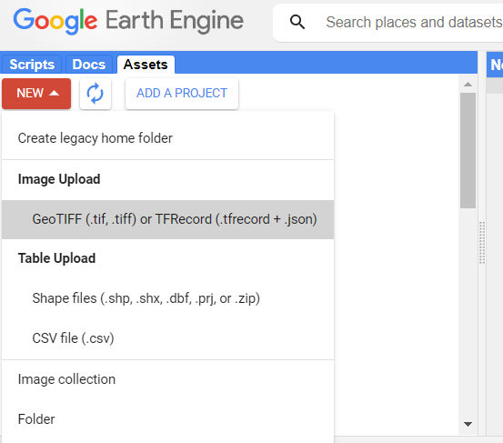
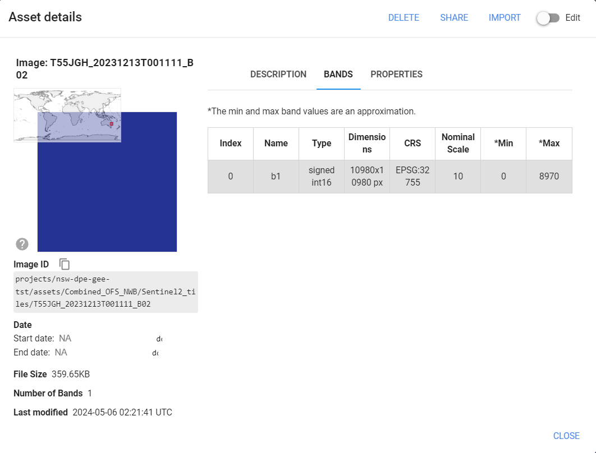
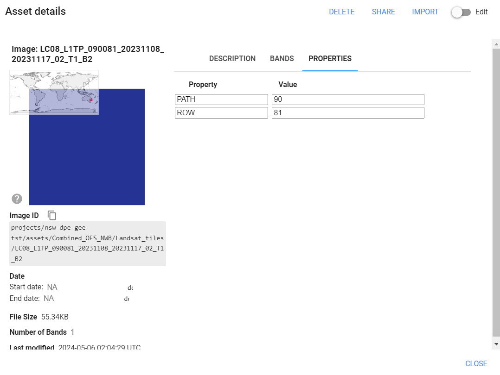
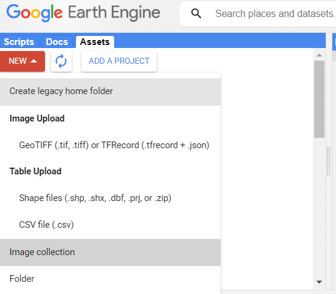
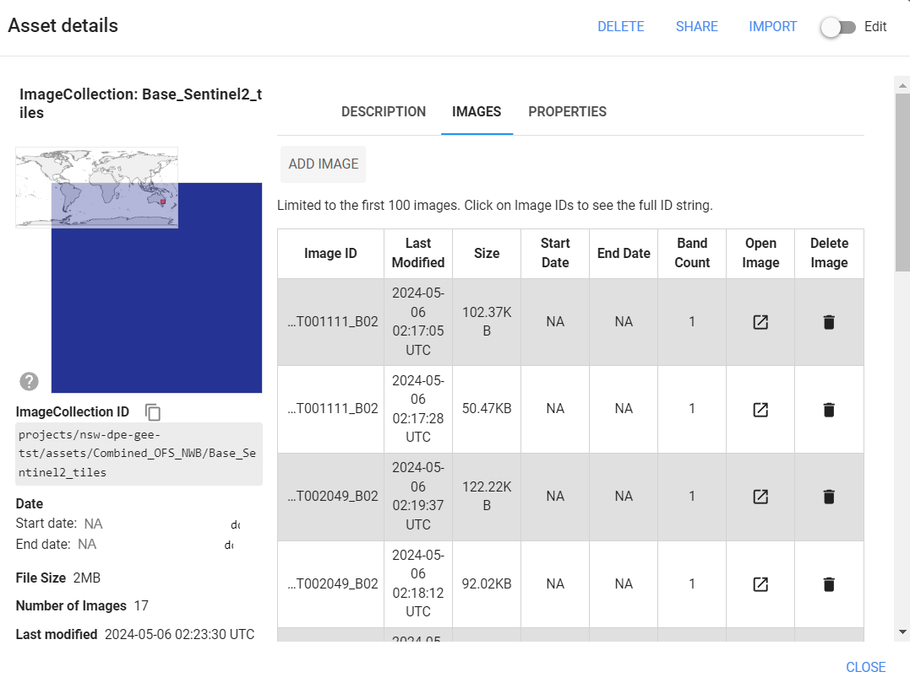
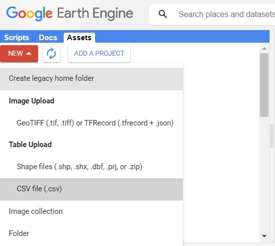

# time-series-OFS

This repository presents an efficient GEE-based solution to mapping water surface area time-series in waterbodies from Landsat and Sentinel-2.

### 1. Create polygon masks

[01_Create_polygon_mask.ipynb](./01_Create_polygon_mask.ipynb): notebook to generate the polygon masks for Landsat and Sentinel-2 tiles using a waterbodies boundaries vector layer.

This creates a .tif file with a mask where each individual polygon is assigned a different value, which allows the process to distinguish them at a raster level.

### 2. Upload polygon masks to GEE Assets 

Once the polygon masks have been generated, they need to be uploaded as cloud assets to GEE.

1. Go to https://code.earthengine.google.com/, sign in and select your cloud project (in this example `nsw-dpe-gee-tst`).

2. Click on NEW > GeoTIFF Image Upload. Select your file in /outputs (e.g., `outputs/Sentinel2_tiles_mask/T55JGH_20231213T001111_B02.tif`).

3. Once uploaded, click on the asset and it should show up like in the screenshot below:

4. Click on Edit then on the PROPERTIES tab and Add property. Add a property called Tile with value 55JGH (or different tilename). This property is needed later on.

5. Repeat for the Landsat tiles, but add two properties, PATH and ROW with their respective values (example below for tile 090081).

6. Once all the individual tiles have been uploaded, click on NEW > Image Collection and create an image collection for Sentinel-2 (named it Base_Sentinel2_tiles) and for Landsat (name it Base_Landsat_tiles). 

7. Then drag and drop all the invididual tiles into their respective image collection (Sentinel-2 or Landsat). The image collection should look as below (17 tiles in that example):

8. Finally, upload the image labels which were saved in /outputs. Click on NEW > CSV file and select the file `outputs/labels_S2.csv` (or Landsat one, they are the same). Call the asset Base_labels, it should contain a table that relates each unique polygon id to an integer value, like shown below:

Now you are all setup to map water surface area time-series in GEE!

### 3. Run GEE scripts in Code Editor

The scripts are found in GEE_scripts and can be copied into the Code Editor and run there. They will output a set of CSV files with the time-series of water surface area for each polygon.

### 4. Postprocess CSV files in Python
