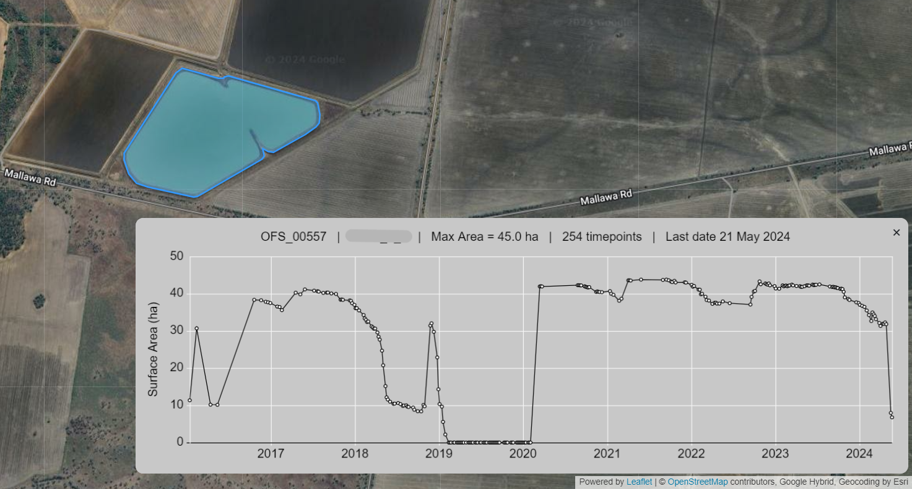
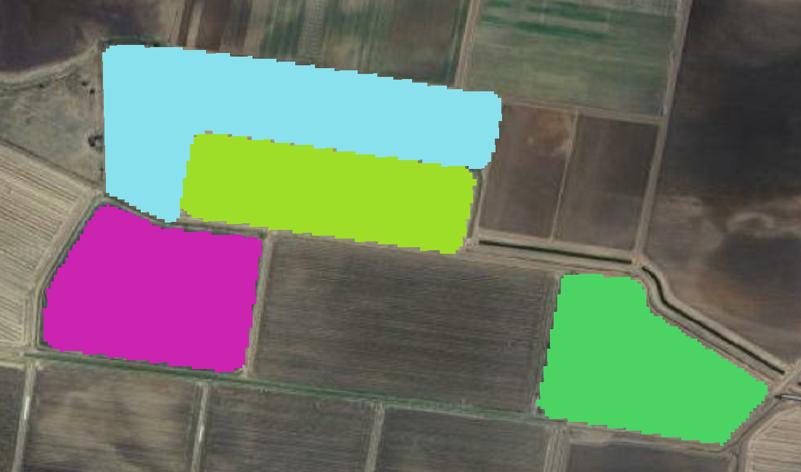
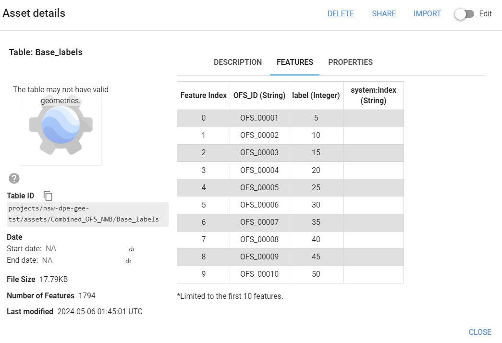
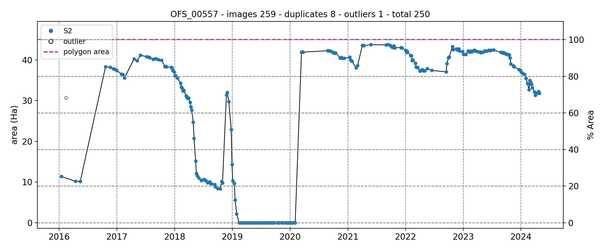

# EOWater: Water surface area time-series from Sentinel-2 and Landat

This repository presents an efficient GEE-based solution to mapping water surface area time-series in waterbodies from Landsat and Sentinel-2.

<p align="center">

</p>

### Table of Contents

- [Installation](#installation)
- [Usage](#usage)
   - [Create polygon masks](#masks)
   - [Upload masks to GEE Assets](#upload)
   - [Run GEE scripts in Code Editor](#gee)
   - [Postprocess water surface areas](#postprocessing)
- [Contributing and Issues](#issues)
- [References and Datasets](#references)

## Installation<a name="instructions"></a>

## Usage<a name="usage"></a>

### 1. Download Sentinel-2 and Landsat original tiles<a name="download"></a>

Two downloading options are available:

- **Option #1**: Download scene from  USGS Earth Explorer

   Visit [USGS Earth Explorer](https://earthexplorer.usgs.gov/) and download a single scene for the required Sentinel-2 and/or Landsat tiles to cover your area of interest.

- **Option #2**: Download scene from  USGS Earth Explorer

   Use the [EE Code Editor](https://code.earthengine.google.com/) to download a single scene for the required Sentinel-2 and/or Landsat tiles to cover your area of interest. Use the [Download_original_tiles_S2.js](./GEE_scripts/Download_original_tiles_S2.js) and [Download_original_tiles_Landsat.js](./GEE_scripts/Download_original_tiles_Landsat.js), and specify the variable `tile_list`.

### 2. Create polygon masks<a name="masks"></a>

[01_Create_polygon_mask.ipynb](./01_Create_polygon_mask.ipynb): notebook to generate the polygon masks for Landsat and Sentinel-2 tiles using a waterbodies boundaries vector layer.

This creates a .tif file with a mask where each individual polygon is assigned a different value, which allows the process to distinguish them at a raster level.

<p align="center">

</p>

### 3. Upload masks to GEE Assets <a name="upload"></a>

Once the polygon masks have been generated in Python, they need to be uploaded as cloud assets into GEE. You can follow the instructions below to perform this step. Two options are available, with different usage scnarios.

If only a few images need to be uploaded (e.g., fewer than 10), the [Option #1 manual process](#upload_to_ee_details_1) is recommended. This method avoids the need to set up Cloud Storage access authentication.

For uploading a large number of images, the [Option #2 automated process](#upload_to_ee_details_2) is more efficient.

*(Optional) If polygon masks in GEE Assets need to be removed and re-uploaded. Use [04_Reset_EE_asset_collection.ipynb](./04_Reset_EE_asset_collection.ipynb) to batch remove all tiles.*

<details id='upload_to_ee_details_1'>
<summary>Option #1 manual process</summary>

1. Go to https://code.earthengine.google.com/, sign in and select your cloud project (in this example `nsw-dpe-gee-tst`).

2. Click on NEW > GeoTIFF Image Upload. Select your file in /outputs (e.g., `outputs/Sentinel2_tiles_mask/T55JGH_20231213T001111_B02.tif`).
<p align="center">

</p>

3. Once uploaded, click on the asset and it should show up like in the screenshot below:
<p align="center">

</p>

4. Click on Edit then on the PROPERTIES tab and Add property. Add a property called Tile with value 55JGH (or different tilename). This property is needed later on.
<p align="center">

</p>

5. Repeat for the Landsat tiles, but add two properties, PATH and ROW with their respective values (example below for tile 090081).
<p align="center">

</p>

6. Once all the individual tiles have been uploaded, click on NEW > Image Collection and create an image collection for Sentinel-2 (named it `Base_Sentinel2_tiles`) and for Landsat (name it `Base_Landsat_tiles`). 
<p align="center">

</p>

7. Then drag and drop all the invididual tiles into their respective image collection (Sentinel-2 or Landsat). The image collection should look as below (17 tiles in that example):
<p align="center">

</p>

8. Finally, upload the image labels which were saved in [/outputs](/outputs). Click on NEW > CSV file and select the file `outputs/labels.csv` (or Landsat one, they are the same). Call the asset `Base_labels`.
<p align="center">

</p>

You should get a table that relates each unique polygon id to an integer value, like shown below:
<p align="center">

</p>
</details>

<details id='upload_to_ee_details_2'>
<summary>Option #2 automated process</summary>

1. Upload polygon masks to Google Cloud Storage (GCS) Buckets.

   (1) Install the [`gcloud`](https://cloud.google.com/sdk/docs/install) CLI accordingly.

   (2) The easiest way is to use [02_Upload_polygon_mask_to_bucket.ipynb](02_Upload_polygon_mask_to_bucket.ipynb) to upload the polygon masks to a Google Cloud Bucket.

   __OR__ use if you are familiar with this, use directly [`gcloud storage`](https://cloud.google.com/storage/docs/discover-object-storage-gcloud):
   ```sh
   # authenticate gcloud log in, make sure you have the necessary permissions to access the GCS Buckets
   gcloud auth login
   gcloud storage cp -m -r -n [LOCAL_PATH] gs://[BUCKET_NAME]/[DESTINATION_PATH]
   ```

2. Ingest polygon masks from Buckets into GEE Assets using [Image Manifest Upload](https://developers.google.com/earth-engine/guides/image_manifest).

   (1) [Install the Earth Engine Python client](https://developers.google.com/earth-engine/guides/python_install).

   (2) [03_Upload_bucket_to_EE_asset.ipynb](./03_Upload_bucket_to_EE_asset.ipynb): create an ImageCollection, `Base_Sentinel2_tiles` and/or `Base_Landsat_tiles`. Ingest the polygon masks into the ImageCollection with the specified properties for each polygon mask.

3. Upload the image labels which were saved in [/outputs](/outputs). Click on NEW > CSV file and select the file `outputs/labels.csv` (or Landsat one, they are the same). Call the asset `Base_labels`.
<p align="center">

</p>
</details>
<br>

:warning: Check that you have these 3 assets uploaded:
- `Base_Sentinel2_tiles`: image collection of polygon masks for each tile of interest for Sentinel-2.
- `Base_Landsat_tiles`: image collection of polygon masks for each tile of interest for Landsat.
- `Base_labels`: table relating each polygon id to its unique label value in the masks.

Now you are all setup to map water surface area time-series in GEE!

### 4. Run GEE scripts in Code Editor<a name="gee"></a>

The scripts are found in GEE_scripts and can be copied into the Code Editor and run there. They will output a set of CSV files with the time-series of water surface area for each polygon. The following scripts are available:
1. [WSA_monitoring_S2.js](./GEE_scripts/WSA_monitoring_S2.js): map water surface area on Sentinel-2 images.
2. [WSA_monitoring_L9.js](./GEE_scripts/WSA_monitoring_L9.js): map water surface area on Landsat 9 images.
3. [WSA_monitoring_L8.js](./GEE_scripts/WSA_monitoring_L8.js): map water surface area on Landsat 8 images.
4. [WSA_monitoring_L7.js](./GEE_scripts/WSA_monitoring_L7.js):
map water surface area on Landsat 7 images.
5. [WSA_monitoring_L5.js](./GEE_scripts/WSA_monitoring_L5.js):
map water surface area on Landsat 5 images.

Additionally, there is a Python script [WSA_scheduled_cloud_function.js](./GEE_scripts/WSA_scheduled_cloud_function.js) that can be setup as a Cloud Function to process Sentinel-2, Landsat 9 and Landsat 8 imagery as a cron job. 


### 5. Postprocess water surface areas<a name="postprocessing"></a>

[05_Postprocess_timeseries.ipynb](./05_Postprocess_timeseries.ipynb): notebook to postprocess the time-series of water surface area generated in GEE and includes the following steps:
- remove outliers using an ad hoc despiking algorithm
- clip time-series to the total area of the polygon (max area of water)
The postprocessed time-series are then saved in individual CSV files named with each polygon identifier. A plot is also created for each polygon.
<p align="center">

</p>
Finally, the notebook also creates an interactive map where users can visualise the polygons and time-series at the same time (click on a polygon to visualise the time-series plot).
<p align="center">

</p>

This can be a useful tool to monitor water resources in a catchment.

## Contributing and Issues<a name="issues"></a>
Having a problem? Post an issue in the [Issues page](https://github.com/ShiruiH/time-series-OFS/issues) (please do not email).

If you are willing to contribute, check out our todo list in the [Projects page](https://github.com/ShiruiH/time-series-OFS/projects?query=is%3Aopen).
1. Fork the repository (./fork).
A fork is a copy on which you can make your changes.
2. Create a new branch on your fork
3. Commit your changes and push them to your branch
4. When the branch is ready to be merged, create a Pull Request (how to make a clean pull request explained [here](https://gist.github.com/MarcDiethelm/7303312))

## References and Datasets<a name="references"></a>

This section provides a list of references on this topic.