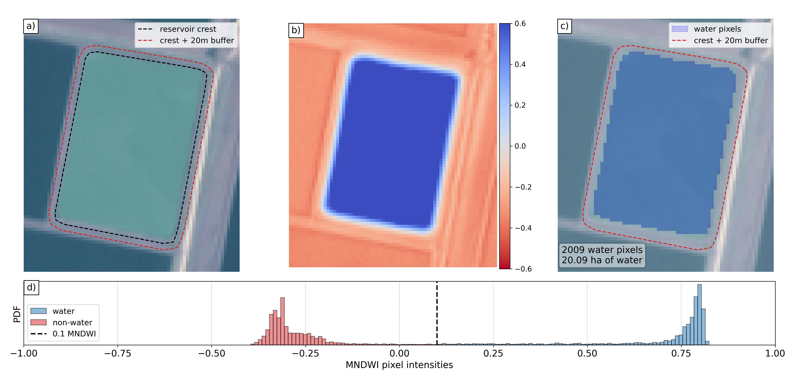

# Summary

`EOWater` is a Google-Earth-Engine-enabled package designed for historical and near real-time monitoring of waterbodies from publicly available Landsat and Sentinel-2 imagery. The package enables users to input a set of polygons representating the boundaries of waterbodies and it outputs a time-series of water surface area, including confidence interval, for each waterbody. The water surface area mapping algorithm is deployed in the cloud in a raster-only process that is highly efficient, scalable and uses optimally GEE's resources. State-of-the-art cloud masking (s2cloudless) is employed to maximise the temporal depth of the observations. In light of the growing gloabal challenge of sustainably managing water resources, this development contributes to help monitoring water resources over large spatio-temporal scales and support planners with low-cost reliable remote sensing data.

# Statement of need

Sustainable freshwater resources are critical in supporting communities, industry and environmental assets such as wetlands. Government agencies are tasked with planning for and managing water collection, storage and distribution, whilst ensuring these resources are shared equitably. To do so, accurate and continuous monitoring of water availability in natural and man-made reservoirs is paramount to inform sustainable water management strategies.

Publicly available Landsat and Sentinel-2 satellite imagery can be leveraged to provide historical and near real-time information on the state of water resources (Donchyts et al., 2022, Fuentes et al. 2021, Krause et al. 2021). Many algoritms exist to map water pixels from multispectral satellite imagery, with software provided with publications often focused on global/continental applications. While these global applications are very impactful, they may not fit with operational requirements, such as providing specific boundaries for waterbodies, customising water index thresholds and selecting cloud mask probability. `EOWater` provides a fully customisable operational workflow to extract water surface areas time-series for user-defined waterbodies in near real-time. The algorithm presented here, based on Python and Javascript scripts using the GEE API, can be efficiently deployed to the cloud and scheduled for a low-cost operational setup. 

# Water surface area monitoring

Add MNDWI equation (cite paper for MNDWI)
Explain 0.1 MNDWI threshold
Explain 20 m buffer around storage boundary

 
Figure 1. Water surface area detection in a reservoir from a Sentinel-2 satellite image (17 Feb 2017). <strong>a)</strong> Sentinel-2 image at 10 m/pixel with the black line indicating the crest of the reservoir and the red line a 20 m buffer around that crest. <strong>b)</strong> Modified Normalised Difference Index (MNDWI) calculated by downsampling the 20 m/pixel shortwave-infrared (SWIR) to 10 m. <strong>c)</strong> Water pixels inside the buffered reservoir boundary, detected with a 0.1 threshold on MNDWI. <strong>d)</strong> Histogram distribution of the MNDWI pixel values highlighting the water (MNDWI above 0.1) and non-water pixels (MNDWI below 0.1). The water surface area is computed by multiplying the number of water pixels by the pixel resoulution of the image.

# Efficient cloud computing process

## Water and Cloud masking

Explain how water masks are generated
Explain how cloud masks are generated (311 QA_PIXEL and s2cloudless prob < 0.4>)
No images are filtered out from the collection

## Raster-based processing

Explain creation of raster masks (refer to notebook)
Explain raster operations (only sum and subtraction of rasters)

## Scheduling and Post-processing

Explain how to schedule to output in cloud buckets
Explain how to post-process from cloud buckets

## Example application in the Murray-Darling Basin

Show example for 1 S2 tile in Northern Basin (the one in the notebook)

# Conclusion

3-4 dot points on usefulness of this toolkit for water resources management.

# Acknowledgements

This work was funded by the Hydrometric Networks and Remote Sensing Program, Murray-Darling Basin Authority, Australian Government.

# References

# Mathematics

Single dollars ($) are required for inline mathematics e.g. $f(x) = e^{\pi/x}$

Double dollars make self-standing equations:

$$\Theta(x) = \left\{\begin{array}{l}
0\textrm{ if } x < 0\cr
1\textrm{ else}
\end{array}\right.$$

You can also use plain \LaTeX for equations
\begin{equation}\label{eq:fourier}
\hat f(\omega) = \int_{-\infty}^{\infty} f(x) e^{i\omega x} dx
\end{equation}
and refer to \autoref{eq:fourier} from text.

# Citations

Citations to entries in paper.bib should be in
[rMarkdown](http://rmarkdown.rstudio.com/authoring_bibliographies_and_citations.html)
format.

If you want to cite a software repository URL (e.g. something on GitHub without a preferred
citation) then you can do it with the example BibTeX entry below for @fidgit.

For a quick reference, the following citation commands can be used:
- `@author:2001`  ->  "Author et al. (2001)"
- `[@author:2001]` -> "(Author et al., 2001)"
- `[@author1:2001; @author2:2001]` -> "(Author1 et al., 2001; Author2 et al., 2002)"

# Figures

Figures can be included like this:

and referenced from text using \autoref{fig:example}.

Figure sizes can be customized by adding an optional second parameter:
{ width=20% }

