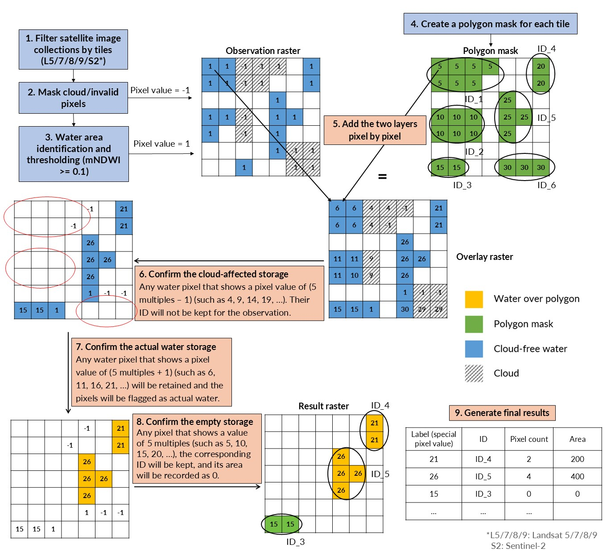

# Summary

`EOWater` is a Google-Earth-Engine-enabled package designed for historical and near real-time monitoring of waterbodies from publicly available Landsat and Sentinel-2 imagery. The package enables users to input a set of polygons representating the boundaries of waterbodies and it outputs a time-series of water surface area, including confidence interval, for each waterbody. The water surface area mapping algorithm is deployed in the cloud in a raster-only process that is highly efficient, scalable and uses optimally GEE's resources. State-of-the-art cloud masking (s2cloudless) is employed to maximise the temporal depth of the observations. In light of the growing gloabal challenge of sustainably managing water resources, this development contributes to help monitoring water resources over large spatio-temporal scales and support planners with low-cost reliable remote sensing data.

# Statement of need

Sustainable freshwater resources are essential for supporting communities, industries and environmental assets such as wetlands. Government agencies are tasked with planning, managing water collection, storage, and distribution, and ensuring equitable sharing of these resources. Moreover, with climate change exacerbating water scarcity, accurate and timely monitoring of water availability in both natural and man-made reservoirs is critical for informing sustainable water management strategies.

Publicly available Landsat and Sentinel-2 satellite imagery can be leveraged to provide historical and near real-time information on the state of water resources [@donchyts2022high; @fuentes2021volume; @krause2021emerging]. Many algoritms exist to map water pixels from multispectral satellite imagery, with software provided with publications often focused on global/continental applications. While these global applications are very impactful, they may not fit with operational requirements, such as providing specific boundaries for waterbodies, customising water index thresholds and selecting cloud mask probability. `EOWater` provides a fully customisable operational workflow to extract water surface areas time-series for user-defined waterbodies in near real-time. The algorithm presented here, based on Python and Javascript scripts using the GEE API, can be efficiently deployed to the cloud and scheduled for a low-cost operational setup. 

# Water surface area monitoring

Publicly available satellite imagery from Landsat 5, Landsat 7, Landsat 8, Landsat 9 and Sentinel-2 is used to map water surface areas. The Top-of-Atmosphere (TOA) collections are selected to maximise temporal depth compared to Surface Reflectance products. The Modified Normalised Difference Water Index (MNDWI) was applied to detect water surface area [@xu2006modification] on individual satellite images. The MNDWI is calculated as follows:

$$
MNDWI = \frac{Green - SWIR}{Green + SWIR}
$$

where *Green* represents the green spectral band, and *SWIR* denotes the shortwave infrared band, such as Sentinel-2 Band 11, Landsat 5/7 Band 5, and Landsat 8/9 Band 6. For Landsat the MNDWI is calculated at 30 m/pixel, while for Sentinel-2 it is calculated at 10 m/pixel by using the *Green* band and downsampling the *SWIR* band from 20 m to 10 m by bilinear interpolation. The MNDWI threshold to distinguish water from non-water pixels is set to 0.1. To select this threshold, an Otsu threshold [@otsu1975threshold] was applied to a balanced water/non water distributions of pixels across 30 waterbodies and 8 years of available Sentinel-2 imagery (more than 10,000 images). From the 10,000 thresholds, the mean was found to be at 0.1. Hence, a fixed threshold, rather than an adaptive threshold, was used as it was shown to provide accurate identification of water and non-water pixels while reducing computational costs, as the threshold does not need to be recalculated for each image, which uses substantial cloud computing resources.

Figure 1 shows an example on-farm storage illustrating the MNDWI pixel distribution and how a 0.1 threshold identifies wet pixels. To account for georeferencing errors in the satellite imagery, a buffer of 20 m was applied around each polygon. This allows the image to wobble +-20 m while the wet pixels are still accounted inside the boundary.

 
Figure 1. Water surface area detection in a reservoir from a Sentinel-2 satellite image (17 Feb 2017). <strong>a)</strong> Sentinel-2 image at 10 m/pixel with the black line indicating the crest of the reservoir and the red line a 20 m buffer around that crest. <strong>b)</strong> Modified Normalised Difference Index (MNDWI) calculated by downsampling the 20 m/pixel shortwave-infrared (SWIR) to 10 m. <strong>c)</strong> Water pixels inside the buffered reservoir boundary, detected with a 0.1 threshold on MNDWI. <strong>d)</strong> Histogram distribution of the MNDWI pixel values highlighting the water (MNDWI above 0.1) and non-water pixels (MNDWI below 0.1). The water surface area is computed by multiplying the number of water pixels by the pixel resoulution of the image.

The next section describes how this methodology is deployed efficiently in a cloud computing environment. 

# Efficient cloud computing process

Once the methodology to map water surface areas has been developed and tested, it needs to be deployed in a cloud computing environment so that it can be scaled up across large spatio-temporal scales. In this toolbox we use the Google Earth Engine (GEE) (GORELICK citation) environment but the same concepts can be replicated on other platforms (Open Data Cube, Microsoft Planetary Computer, etc).

The main concept behind this cloud implementation is to perform all the steps describe above (Figure 1) uniquely in the raster space. In fact, GEE and other image processing cloud platforms are optimised for performing raster operations so it is best practice to avoid vector operations. In the following section, we demonstrate how this water mapping methodology can be implemented by only performing sums of rasters. The full workflow is illustrated in Figure 2 and consists of nine steps.

The first step is to retrieve the Landsat and Sentinel-2 image collections and filter them by tile (no cloud filtering is applied to the image collections). Then, for each scene in the collection, 2 binary images are created: 
1) a *cloud mask*, including no data pixels
2) a *water mask* computed as MNDWI > 0.1
Then the *cloud mask* is subtracted from the *water mask* to create the *observation raster* which contains +1 values for 'water' pixels and -1 values for 'cloud' pixels, the rest being 0s.

The *observation raster* is then combined with a *polygon mask* that is created once for each tile by rasterising the polygon boundaries, buffered by 20 m, onto the pixel grid of each tile and assigning a special label to the pixels belonging to each polygon.

As each *observation raster* is summed with the *polygon mask*, just by looking at the pixel values we can easily determine which polygons are not affected by clouds and how many water pixels they contain.

These steps are described in more details in the following sections.

 
Figure 2. Flowchart illustrating the raster-based water surface area mapping workflow. Water surface areas for each polygon are extracted by solely computing sums of rasters and keeping track of special pixel values that identify each polygon, whether each polygon has water or is dry and whether each polygon contains cloud/no data pixels.

## Water and Cloud masking

The generation of *cloud mask* (Step 2 in Figure 2) includes cloud pixels and scan line gaps in Landsat 7 imagery. The COPERNICUS/S2_CLOUD_PROBABILITY dataset (s2cloudless) is used to mask clouds in Sentinel-2 imagery, with any pixel having a cloud probability greater than 40% marked as cloudy. In the Landsat dataset, the QA_PIXEL and QA_RADSAT bands are used to mask cloudy and low-quality pixels. Both cloudy pixels and no data pixels (affected by the Landsat 7 scan line correction error) are assigned a value of -1.

The generation of the *water mask* (Step 3 in Figure 2) is obtained by applying a threshold of 0.1 to the MNDWI image. Any pixel with an MNDWI value $\geq$ 0.1 is assgined a value of +1.

The two masks are then added together to generate an *observation layer* for each available satellite image.

## Polygon masks

A single *polygon mask* is created for each Landsat and Sentinel-2 tile and used subsequently to process the entire time-series of *observation rasters*. The *polygon mask* is generated by buffering each polygon boundary by 20 m and rasterising it. Then the pixels from each polygon are assigned a special value, in this case a multiple of 5. These special values allows us to keep track of which pixel belongs to which polygon. For example polygon ID 1 is assigned a value of 5, polygon ID 2 a value of 10 and so on and so forth. The result is a raster with special values where the polygons are located and 0s elsewhere. A look-up table is also created that relates each polygon ID to its special pixel value.

## Water surface area extraction

To extract the water surface area inside each polygon, the *polygon mask* is added to the *observation raster* for each date. Then, by looking at the pixel values, the following steps can be completed (see Figure 2):
- discard cloud affected polygons (if one or more cloud pixels are inside the polygon): *pixels = special value - 1*
- extract water pixels in non-cloud affected polygons: *pixels = special value + 1*
- extract empty polygons (no water): *pixels = special value*  
- assign a water surface area to each polygon for each date (if affected by cloud a NaN value is added)

A final CSV file is created with each polygon ID, date and corresponding water surface area.

This process is highly efficient as we were able to extract water surface areas for each polygon using solely sums of rasters.

## Scheduling and Post-processing

The workflow described above was encoded into a series of Python scripts, which can be deployed in Google Cloud Run Functions. By enabling an event handler function, the scripts can be triggered by a Cloud Scheduler to run regularly (e.g., on a weekly basis). The outputs for each run are then saved in Google Cloud buckets for storage and further processing.

## Example application in the Murray-Darling Basin

To demonstrate the capabilities of this workflow to monitor water surface areas over large spatial scales, an example over the Northern Murray Darling Basin in New South Wales, Australia, is presented here. The area of interest contains 1260 polygons over a region that encompasses 14 Landsat tiles and 17 Sentinel-2 tiles. 

By running the scripts included in this Github repository, we were able to extract water surface areas over the last 38 years from all available Landsat 5, 7, 8, 9 and Sentinel-2 images. Once deployed in GEE, the task took 1 hour to run and used limited computation resources (several order of magnitudes less than if we had used vector operations to find how many wet pixels are inside each geometry). This is because this workflow uses a single *polygon mask* for all dates and do not need to process the vector data with millions of vertices at each timestep.

Finally, the `EOWater` toolkit enables users to postproces their water surface area time-series and generate an interactive Leaflet map with all the spatio-temporal data. In those maps, the users can click on a polygon and it will display the time-series of water surface area in that polygon, including an error band calculated assuming that there is half-a-pixel error along the water edge (this assumption can be edited in the code).

 
Figure 3. Example output map for NSW Northern Murray Darling Basin. It provides an interactive Leaflet map where the user can click on a polygon and display the time-series of water surface area inside that polygon.

# Conclusion

3-4 dot points on usefulness of this toolkit for water resources management.

- Efficient and low-cost software for large-scale monitoring of water surface areas over days to decades.
- Novel raster-based methodology using special pixel values and avoiding the computational burden of processing vector data.
- End-to-end workflow that produces maps of water surface areas ready-to-use by end users and can be scheduled for live monitoring.

# Acknowledgements

This work was funded by the Hydrometric Networks and Remote Sensing Program, Murray-Darling Basin Authority, Australian Government.

# References

